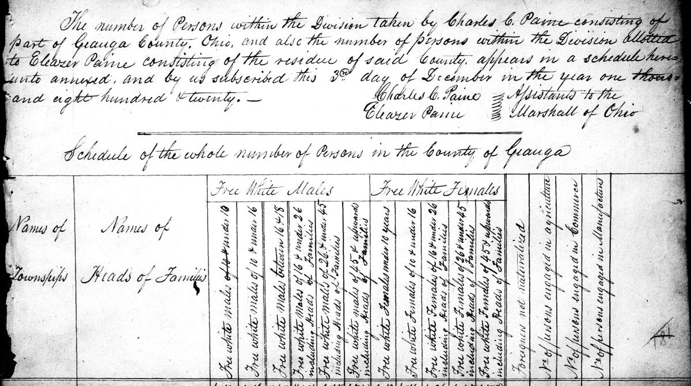
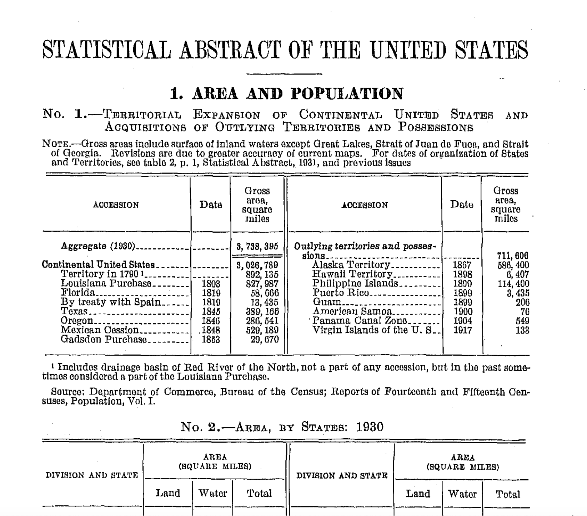

# OCR

Extract text from images and PDFs using HuggingFace image-text-to-text models.

## Parameters

| Parameter         | Default                       | Description                                    |
|-------------------|-------------------------------|------------------------------------------------|
| `--model`         | `stepfun-ai/GOT-OCR-2.0-hf`  | HuggingFace model repo ID                      |
| `--revision`      | `main`                        | Model revision (branch, tag, or commit hash)   |
| `--cache-dir`     |                               | HuggingFace cache directory for model files    |
| `--device`        | `auto`                        | Device to use (`cuda`, `cpu`, or `auto`)       |
| `--output-format` | `text`                        | Output format: `text`, `markdown`, or `json`   |
| `--max-length`    | `4096`                        | Maximum number of tokens to generate per image |
| `--batch-size`    | `4`                           | Number of images to process in parallel on GPU |
| `--prompt`        | `Extract all text from this image.` | Prompt for image-text-to-text models     |

## Supported Input Formats

- Image files (PNG, JPEG, TIFF, etc.)
- PDF files (each page is rendered and processed separately)

## Output Format

Depends on `--output-format`:

- **`text`** (default) — Plain text. For multi-page inputs, pages are separated by form-feed characters (`\f`).
- **`markdown`** — Formatted output preserving tables, equations, and document structure as markdown/LaTeX.
- **`json`** — Structured JSON with per-page text: `{"pages": [{"page": 1, "text": "..."}, ...]}`.

## Models

Any HuggingFace [`image-text-to-text`](https://huggingface.co/models?pipeline_tag=image-text-to-text) model is supported. The [GOT-OCR](https://huggingface.co/stepfun-ai/GOT-OCR-2.0-hf) model is recommended for general-purpose English document OCR. For multilingual documents, see the alternatives below.

| Model | Params | Description | License |
|-------|--------|-------------|---------|
| [`stepfun-ai/GOT-OCR-2.0-hf`](https://huggingface.co/stepfun-ai/GOT-OCR-2.0-hf) (default) | 600M | Full-page OCR with format preservation | Apache 2.0 |
| [`rednote-hilab/dots.ocr`](https://huggingface.co/rednote-hilab/dots.ocr) | 3B | Multilingual document parsing (100+ languages) with layout detection | MIT |
| [`zai-org/GLM-4.1V-9B-Thinking`](https://huggingface.co/zai-org/GLM-4.1V-9B-Thinking) | 10B | Bilingual (English/Chinese) VLM with reasoning, up to 4K image resolution | MIT |
| [`Qwen/Qwen2.5-VL-7B-Instruct`](https://huggingface.co/Qwen/Qwen2.5-VL-7B-Instruct) | 7B | General-purpose VLM with strong OCR and multilingual support | Apache 2.0 |

!!! tip

    GOT-OCR supports plain text and formatted (markdown/LaTeX) output. Use
    `--output-format markdown` to preserve tables, equations, and document structure.

## Examples

### Extract text from a handwritten document

=== "Config"

    ```yaml title="config.yaml"
    tasks:
      - name: ocr
        kind: local
        module: tigerflow_ml.text.ocr.local
        input_ext: .jpg
        output_ext: .txt  # or .md, .json
        params:
          # output_format: text       # (default) plain text
          # output_format: markdown   # formatted markdown/LaTeX
          # output_format: json       # structured JSON with pages
    ```

=== "Input"

    

=== "Output (.txt)"

    ```text title="census-form.txt"
    The number of Persons within the Division taken by Charles C. Paine
    consisting of part of Geauga County, Ohio, and also the number of
    persons within the Division Allotted to Eleazer Paine consisting of
    the residue of said County, appears in a schedule here unto annexed,
    and by us subscribed this 3rd day of December in the year one
    thousand eight hundred & twenty.
        Charles C. Paine    Assistants to the
        Eleazer Paine       Marshall of Ohio

    Schedule of the whole number of Persons in the County of Geauga
    ...
    ```

=== "Output (.md)"

    ```markdown title="census-form.md"
    The number of Persons within the Division taken by **Charles C. Paine**
    consisting of part of **Geauga County, Ohio**, and also the number of
    persons within the Division Allotted to **Eleazer Paine** consisting of
    the residue of said County...

    *Schedule of the whole number of Persons in the County of Geauga*

    ...
    ```

=== "Output (.json)"

    ```json title="census-form.json"
    {
      "pages": [
        {
          "page": 1,
          "text": "The number of Persons within the Division taken by Charles C. Paine consisting of part of Geauga County, Ohio..."
        }
      ]
    }
    ```

### Extract text from a document with tables

=== "Config"

    ```yaml title="config.yaml"
    tasks:
      - name: ocr
        kind: local
        module: tigerflow_ml.text.ocr.local
        input_ext: .png
        output_ext: .md
        params:
          output_format: markdown
    ```

=== "Input"

    

=== "Output (.txt)"

    ```text title="abstract.txt"
    STATISTICAL ABSTRACT OF THE UNITED STATES

    1. AREA AND POPULATION

    No. 1.—TERRITORIAL EXPANSION OF CONTINENTAL UNITED STATES AND
    ACQUISITIONS OF OUTLYING TERRITORIES AND POSSESSIONS

    ACCESSION    Date    Gross area, square miles
    Aggregate (1930)    3,738,395
    Continental United States    3,026,789
    Territory in 1790    892,135
    Louisiana Purchase    1803    827,987
    Florida    1819    58,666
    ...
    ```

=== "Output (.md)"

    ```markdown title="abstract.md"
    # STATISTICAL ABSTRACT OF THE UNITED STATES

    ## 1. AREA AND POPULATION

    **No. 1.—Territorial Expansion of Continental United States and
    Acquisitions of Outlying Territories and Possessions**

    | ACCESSION | Date | Gross area, square miles |
    |---|---|---|
    | Aggregate (1930) | | 3,738,395 |
    | Continental United States | | 3,026,789 |
    | Territory in 1790 | | 892,135 |
    | Louisiana Purchase | 1803 | 827,987 |
    | Florida | 1819 | 58,666 |
    | By treaty with Spain | 1819 | 13,435 |
    | Texas | 1845 | 393,196 |
    | Oregon | 1846 | 286,541 |
    | Mexican Cession | 1848 | 529,189 |
    | Gadsden Purchase | 1853 | 29,670 |
    ...
    ```

=== "Output (.json)"

    ```json title="abstract.json"
    {
      "pages": [
        {
          "page": 1,
          "text": "STATISTICAL ABSTRACT OF THE UNITED STATES\n\n1. AREA AND POPULATION\n\nNo. 1.—TERRITORIAL EXPANSION OF CONTINENTAL UNITED STATES..."
        }
      ]
    }
    ```

### Extract text from a multi-page PDF

=== "Config"

    ```yaml title="config.yaml"
    tasks:
      - name: ocr
        kind: local
        module: tigerflow_ml.text.ocr.local
        input_ext: .pdf
        output_ext: .txt
    ```

=== "Input"

    A multi-page PDF document, e.g. [`2602.15607v1.pdf`](../assets/img/2602.15607v1.pdf).

=== "Output (.txt)"

    ```text title="2602.15607v1.txt"
    [Page 1 text...]
    ␌
    [Page 2 text...]
    ␌
    ...
    ```

    Each page is separated by a form-feed character (`\f`, shown as `␌`).

=== "Output (.md)"

    ```markdown title="2602.15607v1.md"
    [Page 1 formatted text...]
    ␌
    [Page 2 formatted text...]
    ␌
    ...
    ```

=== "Output (.json)"

    ```json title="2602.15607v1.json"
    {
      "pages": [
        {
          "page": 1,
          "text": "..."
        },
        {
          "page": 2,
          "text": "..."
        }
      ]
    }
    ```

### Run on HPC with Slurm

For bulk OCR across large document collections, use the Slurm variant to distribute
work across compute nodes:

```yaml title="config.yaml"
tasks:
  - name: ocr
    kind: slurm
    module: tigerflow_ml.text.ocr.slurm
    input_ext: .pdf
    output_ext: .txt
    max_workers: 4
    worker_resources:
      cpus: 2
      gpus: 1
      memory: 16G
      time: 04:00:00
```
